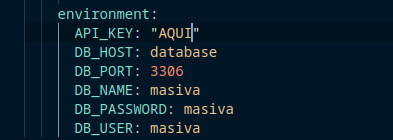

# Creado en **FASTAPI**

Clonar por Github





## Estructura

La estructura del proyecto se divide en los siguientes directorios:

- **`app`:** Este directorio contiene el código fuente de la aplicación.
  - **`core`:** Este directorio contiene el código de configuracion.
  - **`crud`:** Este directorio contiene el código de la API CRUD para el modelo de datos.
  - **`endpoints`:** Este directorio contiene el código de las rutas de la API.
- **`models`:** Este directorio contiene los modelos de datos para la aplicación.
- **`schemas`:** Este directorio contiene los esquemas de datos para la aplicación.
- **`database.py`:** Este archivo contiene la configuración de la base de datos.
- **`main.py`:** Este archivo es el punto de entrada de la aplicación.

## Uso

En al carpeta del projecto ejecutar el docker compose

```
docker compose up
```

Esperar al menos un minuto que la imagen de mysql docker, lea el archivo **init.sql** y que el check health termine su proceso

Ir a Postman y colocar esta direccion

> http://127.0.0.1:8000/api/data/


Esto devolvera la siguiente estructura

```t
{
    "response": [
        {
            "zip_code": string,
            "valid": boolean,
            "city": string,
            "state": string,
            "county": string,
            "timezone": string,
            "area_codes": array[string],
            "country": string,
            "lat": string,
            "lon": string
        },
    ]
}
```

La api de eleccion fue **Zip Code API** de **API Ninjas**

(1) -> GET

Esta es la respuesta para la peticion de una api externa


(2) -> POST

para guardar la informacion Se deberia agarrar uno de los datos devulto en la primera consulta y mandarlo como parte del cuerpo de esta
ruta especificando que va hacer un metodo POST para guardar la informacion

> http://127.0.0.1:8000/api/data/


En la parte de abajo se especifica el dato a guardar

Tener en cuenta

- Todos los datos son obligatorios, no se puede mandar una peticion sin especificar todos los campos en el body
- El zip_code es un campo que no se puede repetir en la base de datos, ya que tiene una restricion como unico
- Varios campos tienen restriciones de cual es el maximo de caracteres a guardar o el minimo

| Campo       | Restrincion               |
| ----------- | ------------------------- |
| zip_code:   | max_length=5 min_length=5 |
| valid:      | bool True                 |
| city:       | str max_length=255        |
| state:      | str max_length=2          |
| county:     | str max_length=255        |
| timezone:   | str max_length=255        |
| area_codes: | List[str]                 |
| country:    | str max_length=2          |
| lat:        | float                     |
| lon:        | float                     |

Si se tiene en cuanta todas las restriciones y el dato guardado es exitoso se tiene esta respuesta  


Es el objecto guardado en la base de datos

(3) -> GET - {id}

Se coloca la siguiente ip en postma


Se cambia **{id}** por la ip que se quiere buscar


Para esta consulta se tiene la siguiente informacion


Todas las id de los datos, consultar la siguiente url

> http://127.0.0.1:8000/api/data/all/


# FUNCIONANDO


